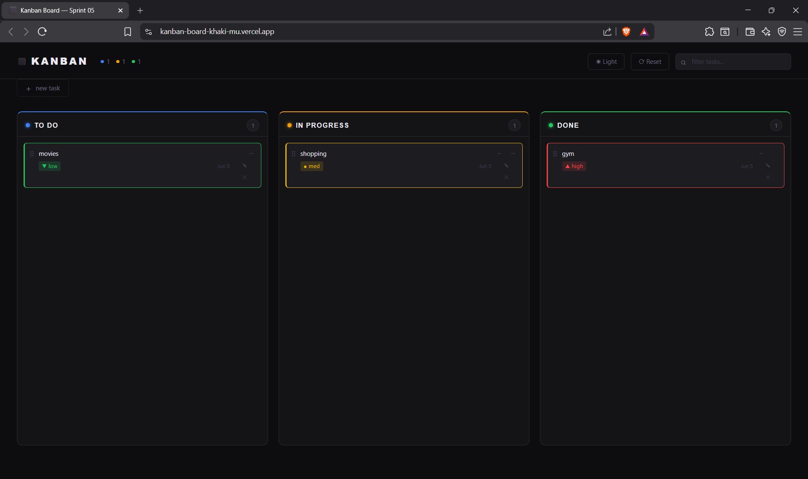
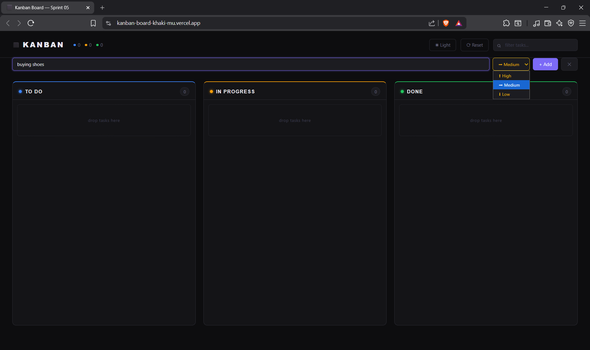
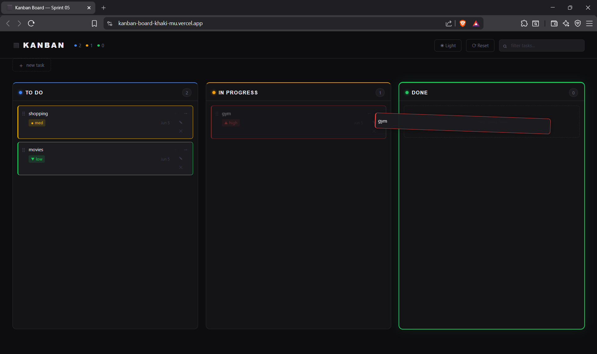
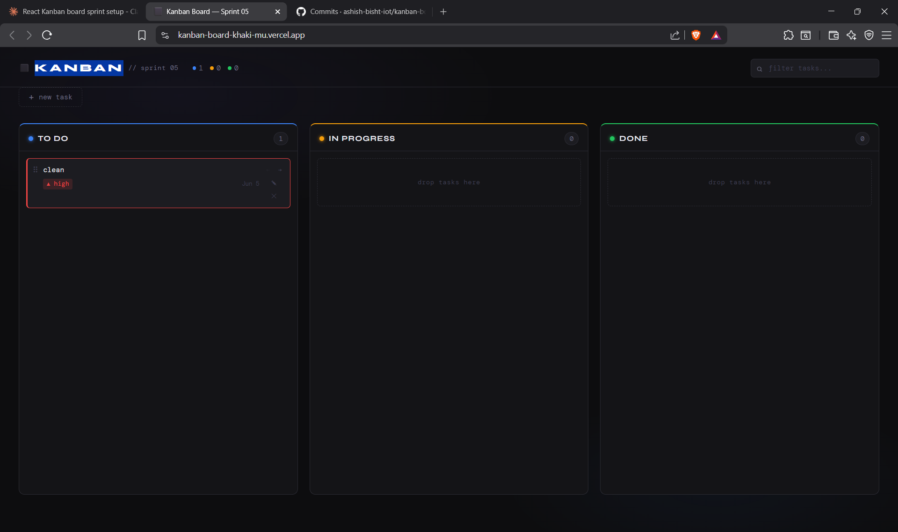

# Kanban Task Board

A Trello-style task management board built with **React + Vite** featuring full drag-and-drop, priority tagging, inline editing, and persistent state.

---

## 📸 Screenshots

### Board Overview


### Adding a Task


### Drag and Drop


### Inline Editing


### Search Filter


---

## ✨ Features

- **Base MVP** — 3-column Kanban layout (To Do, In Progress, Done) with Add, Delete, and Move controls on every card
- **Inline Editing** — Double-click any task to edit it in place; save with Enter or click away
- **Priority System** — Assign High / Medium / Low priority during creation; cards render with red / yellow / green left border accordingly
- **localStorage Persistence** — Board state survives hard refreshes; tasks are saved automatically on every change
- **Drag and Drop** — Drag cards between columns or reorder within a column using `@dnd-kit`
- **Real-time Search** — Global filter input narrows visible tasks across all three columns instantly
- **Dark Theme** — Minimal dark UI with color-coded columns and priority indicators

---

## 🛠️ Tech Stack

| Technology | Purpose |
|---|---|
| React 18 | Frontend framework |
| Vite 8 | Build tool & dev server |
| @dnd-kit | Drag-and-drop interactions |
| localStorage | Client-side state persistence |
| Vercel | Deployment & hosting |
| Vanilla CSS | Styling with CSS variables |

---

## 📁 Project Structure

```
kanban-board/
├── src/
│   ├── main.jsx                      # React entry point
│   ├── App.jsx                       # Root component — owns all state and DnD context
│   ├── App.css                       # Header, board layout, search styles
│   ├── index.css                     # Design tokens, global reset, background
│   └── components/
│       ├── AddTaskForm.jsx           # Task creation form with priority dropdown
│       ├── AddTaskForm.css
│       ├── Column.jsx                # Droppable column with task list
│       ├── Column.css
│       ├── TaskCard.jsx              # Sortable card — edit, delete, move, priority
│       └── TaskCard.css
├── index.html
├── .gitignore
├── Prompts.md                        # AI usage log
├── package.json
└── vite.config.js
```

---

## 📝 How It Works

1. Click **+ new task** to open the creation form
2. Enter a task description and select a priority — **High**, **Medium**, or **Low**
3. Press **Enter** or click **Add** — the task appears in the **To Do** column
4. Use the **← →** buttons to move cards between columns, or **drag and drop** them directly
5. **Double-click** any task text to edit it inline
6. Use the **search bar** to filter tasks across all columns in real time
7. All changes are saved to **localStorage** automatically — refresh the page and nothing is lost

---

## ⚛️ React Concepts Demonstrated

- `useState` for managing arrays of task objects
- `useEffect` for syncing state to localStorage
- `useCallback` for memoizing event handlers
- Props drilling from App → Column → TaskCard
- Lifting state up — child components call parent functions to update state
- Controlled inputs for the add form and inline editor
- Conditional className rendering based on task priority
- `@dnd-kit` — DndContext, useSortable, useDroppable, DragOverlay

---
